### 07/06/2020

#### 1. [Neural Combinatorial Optimization With Reinforcement Learning](https://arxiv.org/pdf/1611.09940) - 2016

> Pointer Network + Attention + RL to solve TSP problem.

Sequence to sequence problems like machine translation. But the vanilla sequence to sequence model (Encoder-decoder) has an issue: networks trained in this fashion cannot generalize to inputs with more than n cities.

  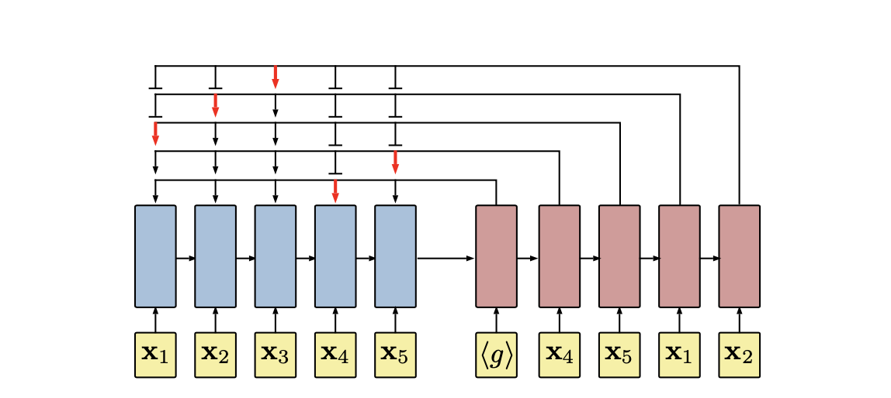 
  Pointer Network (the output sequence length is determined by the source sequence.)

Supervised Learning: Generalization is poor. (1) the performance of the model is tied to the quality of the supervised labels, (2) getting high-quality labeled data is expensive and may be infeasible for new problem statements, (3) one cares more about finding a competitive solution more than replicating the results of another algorithm.

Actor: REINFORCE algorithm. b(s) estimates the expected tour length to reduce the variance of the gradients.
$$
\bigtriangledown_\theta J(\theta|s) = E_\pi[(L(\pi|s) - b(s))\bigtriangledown_\theta\log p_\theta(\pi|s)]
$$
Critic: Learn the expected tour length found by our current policy pθ given an input sequence s.
$$
L(\theta_v) = \frac{1}{B}\sum_{i=1}^B||b_{\theta_v}(s_i) - L(\pi_i|s_i)||_2^2
$$

  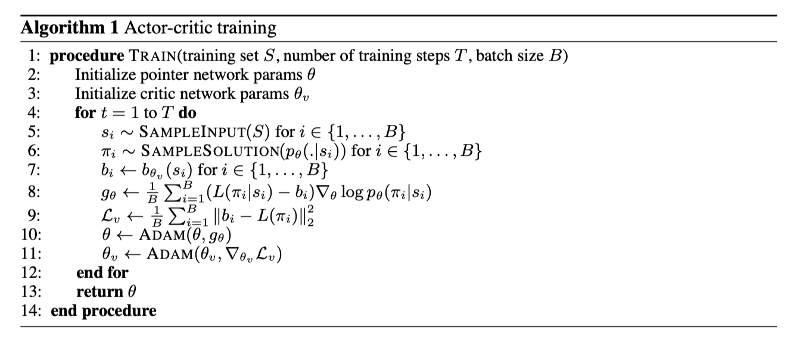

Problem and Challenge: 

* TSP has few constraints.
* The RNN of Pointer Network's encoder isn't necessary - Order doesn't matter.
* GENERALIZATION TO OTHER PROBLEMS:
  * by assigning zero probabilities to branches that are easily identifiable as infeasible.
  * consists in augmenting the objective function with a term that penalizes solutions for violating the problem’s constraints.

#### 2. [Reinforcement Learning for Solving the Vehicle Routing Problem](https://papers.nips.cc/paper/8190-reinforcement-learning-for-solving-the-vehicle-routing-problem.pdf) - NeurIPS 2018

> One vehicle with a limited capacity is responsible for delivering items to many geographically distributed customers with finite demands.

* One major issue that complicates the direct use of [1] for the VRP is that it assumes the system is static over time. In the VRP, the demands change over time.
  $$
  x_t^i = (s_i, d_t^i)
  $$
  For instance, in the VRP, $$x_t^i$$ gives a snapshot of the customer i, where $$s_i$$ corresponds to the 2-dimensional coordinate of customer i’s location and $$d_t^i$$ is its demand at time t. 

* RNN encoder adds extra complication to the encoder but is actually not necessary.

  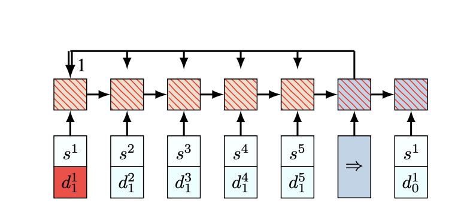
  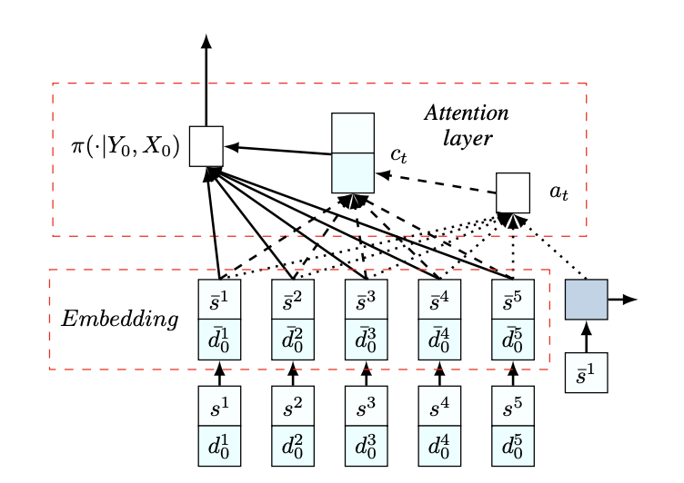 

> Experiment:
>
> The node locations and demands are randomly generated from a fixed distribution. 
>
> * Location: [0, 1] * [0, 1]
> * Demand: [1, 2, ..., 9] or continuous distribution.
>
> After visiting customer node i, the demands and vehicle load are updated.
>
> Using negative total vehicle distance as the reward signal.

Satisfying capacity constraints by **masking scheme**.

*(i)* nodes with zero demand are not allowed to be visited; *(ii)* all **customer** nodes will be masked if the vehicle’s remaining load is exactly 0; and *(iii)* the customers whose demands are greater than the current vehicle load are masked.

The solution can allocate the demands of a given customer into multiple routes by relaxing *(iii)*.

> **Dynamically changing VRPs.**
>
> For example, in the VRP, the remaining customer demands change over time as the vehicle visits the customer nodes; or we might consider a variant in which new customers arrive or adjust their demand values over time, independent of the vehicle decisions.

#### 3. [Learning to Branch in Mixed Integer Programming](https://www.aaai.org/ocs/index.php/AAAI/AAAI16/paper/download/12514/11657) - AAAI 2016

> Branch-and-Bound: Two of the main decisions to be made during the algorithm are node selection and variable selection.

Traditional branching strategies fall into two main classes: 

* Strong Branching (SB) approaches exhaustively test variables at each node, and choose the best one with respect to closing the gap between the best bound and the current best feasible solution value. 
  * fewer search tree nodes
  * more computation time
* Pseudocost (PC) branching strategies are **engineered to imitate SB** using a fraction of the computational effort, typically achieving a good trade-off between number of nodes and total time to solve a MIP. 
  * based on human intuition and extensive engineering
  * requiring significant manual tuning

Two of the main decisions to be made during B&B:

* Node selection: Select an active node N. Following that, the LP relaxation at N is solved. Based on ub/lb to find the nodes needed to be pruned.
* Variable selection: Given a node N whose LP solution X is not integer-feasible. Let C is the set of branching candidates whose value is not integer in X. Calculate the score *(SB/PC)* for C and choose a variable based on it.

  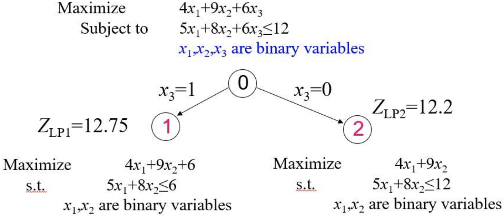 
  Branch-and-Bound

**Learn branching strategies directly from data. (data-driven, on-the-fly design of variable selection strategies)**

> A machine learning (ML) framework for **variable selection** in MIP. It observes the decisions made by Strong Branching (SB), a time-consuming strategy that produces small search trees, collecting features that characterize the candidate branching variables at each node of the tree. 
>
> Learn a function of the variables’ features that will rank them in a similar way, without the need for the expensive SB computations.
>
> *(i)* can be applied to instances on-the-fly.
>
> *(ii)* consists of solving a ranking problem, as opposed to regression or classification.

Overview:

> *(i)* Data collection: for a limited number of nodes i, SB is used as a branching strategy. At each node, the computed SB scores are used to assign labels to the candidate variables; and corresponding variable features are also extracted.
>
> *(ii)* Learning: the dataset is fed into a learning-to-rank algorithm that outputs a vector of weights for the features.
>
> *(iii)* ML-Based Branching: Learned weight vector is used to score variables instead SB, which is computationally expensive.

Learning-to-rank: $$l(.)$$ is based on *pairwise loss*, a common IR measure.

$$
w^*=\mathop{\arg\min}_{w}\sum_N\ell(y^i - \hat{y}^i) + \lambda||w||_2^2
$$

  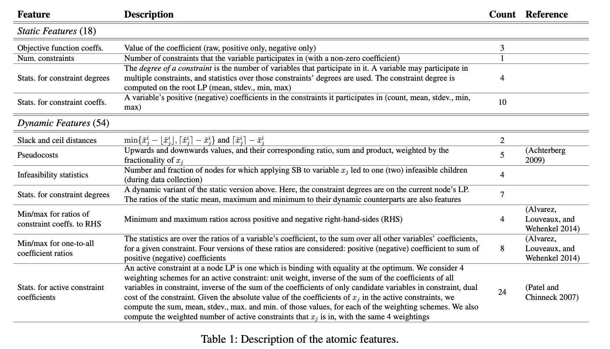

> Future:
>
> * may also used for other components of the MIP solver such as cutting planes and node selection.
> * RL instead of the batch supervised ranking approach.

#### 4. [A General Large Neighborhood Search Framework for Solving Integer Programs](https://arxiv.org/pdf/2004.00422) - 2020

> LNS + Learning a Decomposition
>
> Design abstractions of large-scale combinatorial optimization problems that can leverage existing state-of-the-art solvers in general purpose ways. A general framework that avoids requiring domain-specific structures/knowledge.

***Learning to Optimize***

> *(i)* Learning to Search: Learning search heuristics. A collection of recent works explore learning data-driven models to outperform manually designed heuristics. 
>
> The most common choice is the open-source solver SCIP [1], while some previous work relied on callback methods with CPlex. However, in general, one cannot depend on highly optimized solvers being amenable to incorporating learned decision procedures as subroutines. 
>
> *(ii)* Algorithm Configuration: A process for tuning the hyperparameters of an existing approach. One limitation of algorithm configuration approaches is that they rely on the underlying solver being able to solve problem instances in a reasonable amount of time, which may not be possible for hard problem instances.
>
> *(iii)* Learning to Identify Substructures: A canonical example is learning to predict backdoor variables. Our approach bears some high-level affinity to this paradigm, as we effectively aim to learn decompositions of the original problem into a series of smaller subproblems. However, our approach makes a much weaker structural assumption, and thus can more readily leverage a broader suite of existing solvers.

***Decomposition-based LNS for Integer Programs***

> LNS Framework: Formally, let X be the set of all variables in an optimization problem and S be all possible value assignments of X. For a current solution s ∈ S, a neighborhood function N(s) ⊂ S is a collection of candidate solutions to replace s, afterwards a solver subroutine is evoked to find the optimal solution within N(s).
>
> Methodology: Defining decompositions of its integer variables into disjoint subsets. Afterwards, we can select a subset and use an existing solver to optimize the variables in that subset while holding all other variables fixed. Random decomposition empirically already delivers very strong performance.

  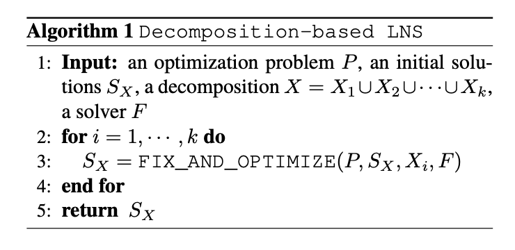 

***Learning a Decomposition - [Ref-IL](https://medium.com/@SmartLabAI/a-brief-overview-of-imitation-learning-8a8a75c44a9c)***

> *(i)* Reinforcement Learning - REINFORCE: 
>
> State is a vector representing an assignment for variables in X, i.e., it's an incumbent solution.
>
> Action is a decomposition of X.
>
> Reward $$r(s,a) = J(s) - J(s')$$, which is the difference of obj between old and new solution.
>
> *(ii)* Imitation Learning:
>
> Generate a collection of good decompositions: by sampling random decompositions and take the ones resulting in best objectives as demonstrations. See Alg 2.
>
> Then apply behavior cloning, which treats policy learning as a supervised learning problem.

  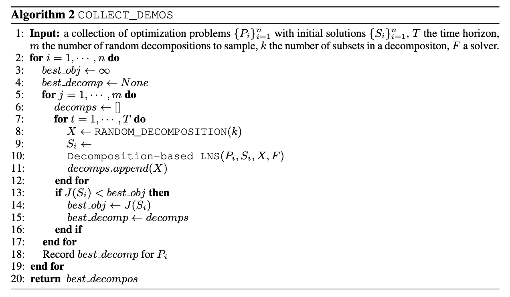 
	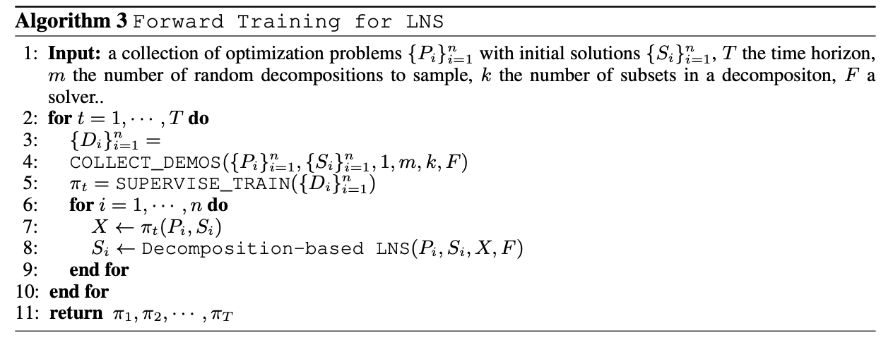

***Experiment***

> * Gurobi
> * Random-LNS
> * BC-LNS: Behavior Cloning
> * FT-LNS: Forward Training
> * RL-LNS: REINFORCE
>
> Evaluate on 4 NP-hard benchmark problems
>
> Per-Iteration Comparison & Running Time Comparison
>
> Comparison with Domain-Specific Heuristics
>
> Comparison with Learning to Branch Methods

### 07/13/2020

#### 5. [Machine Learning for Combinatorial Optimization: a Methodological Tour d’Horizon](https://arxiv.org/pdf/1811.06128v2.pdf) - 2020

> This paper surveys the recent attempts, both from the machine learning and operations research communities, at leveraging machine learning to solve combinatorial optimization problems. Aiming at highlighting promising research directions in the use of ML within CO, instead of reporting on already mature algorithms.

* Motivations: Approximation and Discovery of new policies
  * With domain-knowledge, but want to alleviate the computational burden by approximating some of decisions with ML.
  * expert knowledge is not satisfactory, and wishes to find better ways of making decisions.

**Learning methods**

> In the case of using ML to approximate decisions: E.g.: Imitation Learning - blindly mimic the expert
>
> > ***Demonstration***
> >
> > 1. Baltean-Lugojan et al. (2018): cutting plane selection policy.
> >
> > 2. **Branching policies** in B&B trees of MILPs: The choice of variables to branch on can dramatically change the size of the B&B tree, hence the solving time.
> >
> >    *(i)* Inputs to the ML model are engineered as a vector of fixed length with static features descriptive of the instance, and dynamic features providing information about the state of the B&B process: Marcos Alvarez et al. (2014, 2016, 2017); Khalil et al. (2016)
> >
> >    *(ii)* Use a raw exhaustive representation(a bipartite graph) of the sub-problem associated with the current branching node as input to the ML model: Gasse et al. (2019)
> >
> >    Node selection is also a critical decision in MILP.
>
> In the case where one cares about discovering new policies: Reinforcement Learning
>
> > ***Experience***
> >
> > Some methods that were not presented as RL can also be cast in this MDP formulation, even if the optimization methods are not those of the RL community. **Automatically build specialized heuristics for different problems.** The heuristics are build by orchestrating a set of moves, or subroutines, from a pre-defined domain-specific collections. E.g. Karapetyan et al. (2017), Mascia et al. (2014).
>
> Demonstration and Experience are not mutually exclusive and most learning tasks can be tackled in both ways. 
>
> > E.g.: Selecting the branching variables in an MILP branch-and- bound tree could adopt anyone of the two prior strategies. Or an intermediary approach: Learn a model to dynamically switch among predefined policies during B&B based on the current state of the tree: Liberto et al. (2016)

**Algorithmic structure**

>**End to end learning:** Train the ML model to output solutions directly from the input instance.
>
>

> 
>

>
>> Pointer Network/GNN + Supervised Learning/RL
>>
>> Emami and Ranka (2018) and Nowak et al. (2017): Directly approximating a double stochastic matrix in the output of the neural network to characterize the permutation.
>>
>> Larsen et al. (2018): Train a neural network to predict the solution of a stochastic load planning problem for which a deterministic MILP formulation exists.
>
>**Learning to configure algorithms:** ML can be applied to provide additional pieces of information to a CO algorithm. For example, ML can provide a parametrization of the algorithm.
>
>

>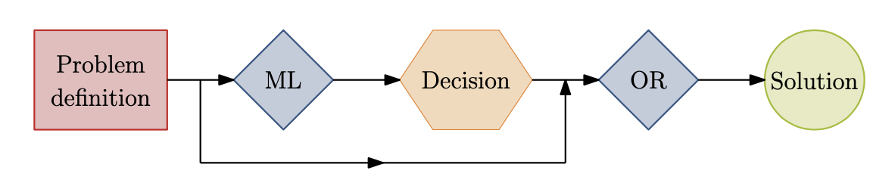 
>

>
>>  Kruber et al. (2017): Use machine learning on MILP instances to estimate beforehand whether or not applying a Dantzig-Wolf decomposition will be effective. 
>>
>> Bonami et al. (2018): Use machine learning to decide if linearizing the problem will solve faster.
>>
>> The heuristic building framework used in Karapetyan et al. (2017) and Mascia et al. (2014).
>
>**Machine learning alongside optimization algorithms:** build CO algorithms that repeatedly call an ML model throughout their execution.
>
>

>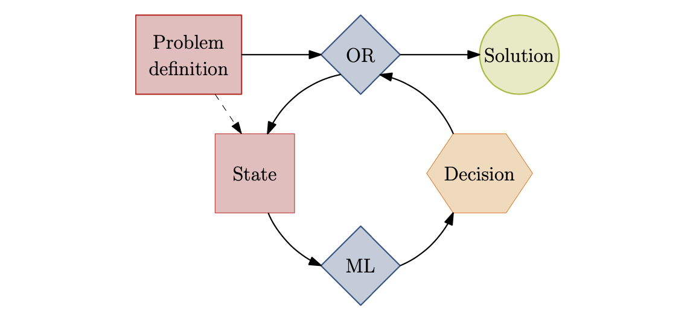 
>

>
>>This is clearly the context of the branch-and-bound tree for MILP.
>>
>>* Select the branching variable
>>* The use of primal heuristics
>>* Select promising cutting planes

**Learning objective**

>**Multi-instance formulation**
>$$
>\min_{a\in\mathcal{A}}\mathbb{E}_{i\sim p}m(i,a)
>$$
>**Surrogate objectives**
>
>The sparse reward setting is challenging for RL algorithms, and one might want to design a surrogate reward signal to encourage intermediate accomplishments.
>
>**On generalization**
>
>* new instances: Empirical probability distribution instead of true probability distribution.
>* other problem instances
>* unexpected sources of randomness
>* “structure” and “size”
>
>**Single instance learning**
>
>This is an edge scenario that can only be employed in the setting, where ML is embedded inside a CO algorithm; otherwise there would be only one training example! There is therefore no notion of generalization to other problem instances. Nonetheless, the model still needs to generalize to unseen states of the algorithm.
>
>Khalil et al. (2016): Learn an instance-specific branching policy. The policy is learned from strong-branching at the top of the B&B tree, but needs to generalize to the state of the algorithm at the bottom of the tree, where it is used.
>
>**Fine tuning and meta-learning**
>
>A compromise between instance-specific learning and learning a generic policy is what we typically have in multi-task learning. Start from a generic policy and then adapt it to the particular instance by a form of fine-tuning procedure.
>
>**Other metrics**
>
>Metrics provide us with information not about final performance, but about offline computation or the number of training examples required to obtain the desired policy. Useful to calibrate the effort in integrating ML into CO algorithms.

**Methodology**

> **Demonstration and Experience**
>
> Demonstration: the performance of the learned policy is bounded by the expert; learned policy may not generalize well to unseen examples and small variations of the task and may be unstable due to accumulation of errors.
>
> Experience: potentially outperform any expert; the learning process may get stuck around poor solutions if exploration is not sufficient or solutions which do not generalize well are found. It may not always be straightforward to define a reward signal. 
>
> It is a good idea to start learning from demonstrations by an expert, then refine the policy using experience and a reward signal. E.g. AlphaGo paper (Silver et al., 2016).
>
> **Partial observability**
>
> Markov property does not hold.
>
> A straightforward way to tackle the problem is to compress all previous observations using an RNN.
>
> **Exactness and approximation**
>
> In order to build exact algorithms with ML components, it is necessary to apply the ML where all possible decisions are valid.
>
> * End to end learning: the algorithm is learning a heuristic; no guarantee in terms of optimality and feasibility.
>
> * Learning to configure algorithms: applying ML to select or parametrize a CO algorithm will keep exactness if all possible choices that ML discriminate lead to complete algorithms.
>
> * Machine learning alongside optimization algorithms: all possible decisions must be valid.
>   * branching among fractional variables of the LP relaxation
>   * selecting the node to explore among open branching nodes (He et al., 2014)
>   * deciding on the frequency to run heuristics on the B&B nodes (Khalil et al., 2017b)
>   * selecting cutting planes among valid inequalities (Baltean-Lugojan et al., 2018)
>   * removing previous cutting planes if they are not original constraints or branching decision
>   * *Counter-example*: Hottung et al. (2017). In their B&B framework, bounding is performed by an approximate ML model that can overestimate lower bounds, resulting in invalid pruning. The resulting algorithm is therefore not an exact one.

**Challenges**

> **Feasibility**
>
> Finding feasible solutions is not an easy problem, even more challenging in ML, especially by using neural networks.
>
> End to end learning: The issue can be mitigated by using the heuristic within an exact optimization algorithm (such as branch and bound).
>
> **Modelling**
>
> The architectures used to learn good policies in combinatorial optimization might be very different from what is currently used with deep learning. RNN; GNN
>
> For a very general example, Selsam et al. (2018) represent a satisfiability problem using a bipartite graph on variables and clauses. This can generalize to MILPs, where the constraint matrix can be represented as the adjacency matrix of a bipartite graph on variables and constraints, as done in Gasse et al. (2019).
>
> **Scaling**
>
> A computational and generalization issue. All of the papers tackling TSP through ML and attempting to solve larger instances see degrading performance as size increases much beyond the sizes seen during training. 
>
> **Data generation**
>
> "*sampling from historical data* is appropriate when attempting to mimic a behavior reflected in such data".
>
> In other cases, i.e., when we are not targeting a specific application for which we would have historical data: 
>
> * Smith-Miles and Bowly (2015): Defining an instance feature space -> PCA -> using an evolutionary algorithm to drive the instance generation toward a pre-defined sub-space
> * Malitsky et al. (2016): generate problem instances from the same probability distribution using LNS.

### 07/20/2020

#### 6. Backdoors in the Context of Learning - 2009

> Traditional backdoor is oblivious to “learning” during search -> extend to the context of learning.
>
> The smallest backdoors for SAT that take into account **clause learning** and **order-sensitivity of branching** can be exponentially smaller than “traditional” backdoors.
>
> Reference: [Conflict Driven Clause Learning(CDCL & DPLL & BCP)](https://cse442-17f.github.io/Conflict-Driven-Clause-Learning/)

**Backdoor set**: a set of variables such that once they are instantiated, the remaining problem simplifies to a tractable class.

Weak and Strong Backdoors for SAT:

> Given a CNF formula F on variables X, a subset of variables B ⊆ X is a weak backdoor for F w.r.t. a sub-solver A if for some truth assignment τ : B → {0, 1}, A returns a satisfying assignment for F |τ . Such a subset B is a strong backdoor if for every truth assignment τ : B → {0, 1}, A returns a satisfying assignment for F|τ or concludes that F|τ is unsatisfiable.

Weak backdoor sets capture the fact that a well-designed heuristic can get “lucky” and find the solution to a hard satisfiable instance if the heuristic guidance is correct even on the small fraction of variables that constitute the backdoor set. Similarly, strong backdoor sets B capture the fact that a systematic tree search procedure (such as DPLL) restricted to branching only on variables in B will successfully solve the problem, whether satisfiable or unsatisfiable. Furthermore, in this case, the tree search procedure restricted to B will succeed *independently of the order* in which it explores the search tree.

Learning-Sensitive Backdoors for SAT:

> Consider the unsatisfiable SAT instance, F1:
>
> (x∨p1), (x∨p2), (¬p1 ∨¬p2 ∨q), (¬q∨a), (¬q∨¬a∨b), (¬q∨¬a∨¬b), (¬x∨q∨r), (¬r∨a), (¬r∨¬a∨b), (¬r∨¬a∨¬b)

#### 7. Backdoors to Combinatorial Optimization: Feasibility and Optimality - 2009

> We show that finding a feasible solution and proving optimality are characterized by backdoors of different kinds and size.

***Combine with branch-and-bound style systematic search and learning during search***

> In SAT, this took the form of “clause learning” during the branch-and bound process, where new derived constraints are added to the problem upon backtracking. In MIP, this took the form of adding “cuts” and “tightening bounds” when exploring various branches during the branch-and-bound search.

***Backdoor Sets for Optimization Problems***

> Traditional Backdoors
>
> * Weak optimality backdoors
> * Optimality-proof backdoors
> * Strong optimality backdoors: both find an optimal solution and prove its optimality, or to show that the problem is infeasible altogether.
>
> Order-Sensitive Backdoors
>
> > It was often found that variable-value assignments at the time CPLEX finds an optimal solution during search do not necessarily act as traditional weak backdoors, i.e., feeding back the specific variable-value assignment doesn’t necessarily make the underlying sub-solver find an optimal solution. Because B&B algorithm learns information about the search space as they explore the search tree. This leads to a natural distinction between “traditional” (as defined above) and “order-sensitive” weak optimality backdoors.

***Experiments***

> Probability of Finding Small Backdoors

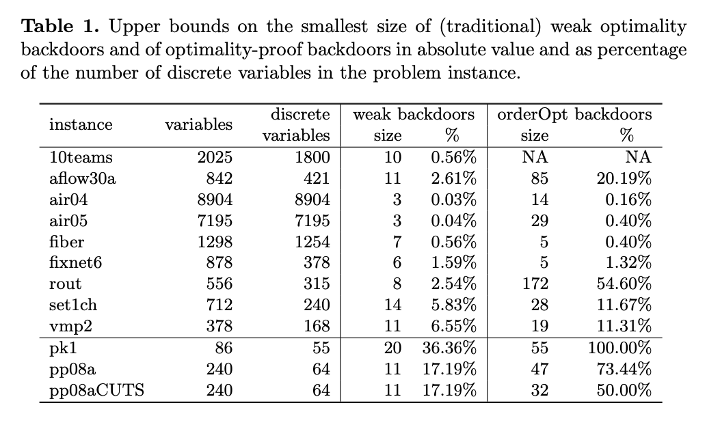 

> LP Relaxations as Primal Heuristics: How a MIP solver could exploit its sub-solver to find small backdoors.

Rather than sampling sets of desired cardinality by selecting variables uniformly at random, we biased the selection based on **the “fractionality” of variables in the root relaxation**. Assign a weight to each fractional variables $$f(x)=\min(|x|, |1-x|)$$, which captures the “infeasibility” of a variable, and is a well-known measure for picking branching variables in mixed integer programming. We choose a subset of size k where each variable is selected with probability proportional to its normalized weight. 

One thing to note is that before solving the root LP, CPLEX applies a **pre-processing procedure** which simplifies the problem and removes some variables whose values can be trivially inferred or can be expressed as an aggregation of other variables. To evaluate whether the biased selection draws its advantage over the uniform selection solely on avoiding pre-processed variables, we evaluated the probability of selecting a backdoor set when sampling uniformly among only the discrete variables remaining after pre-processing (See Fig 4 presolve-*). These curves show that choosing uniformly among the remaining variables is more effective for finding backdoors than choosing uniformly among all discrete variables, but it is not as good as the biased selection based on the root LP relaxation.

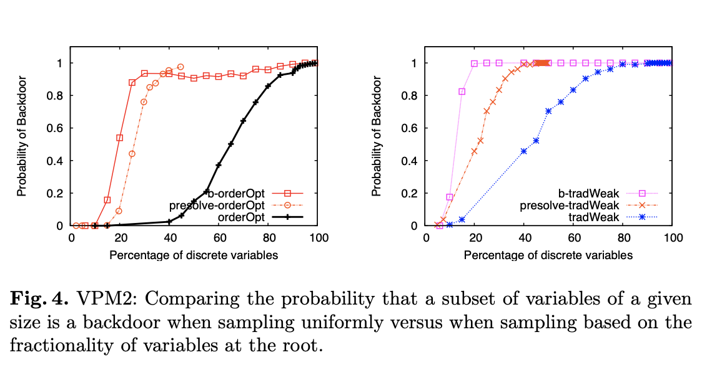 

### 07/31/2020

#### 8. Learning Combinatorial Optimization Algorithms over Graphs (NeurIPS-17)

>The same optimization problem is solved again and again on a regular basis, maintaining the same problem structure but differing in the data. The learned greedy policy behaves like a meta-algorithm that incrementally constructs a solution, and the action is determined by the output of a graph embedding network capturing the current state of the solution.

***Recent Work***

Pointer Network & Neural Combinatorial Optimization With Reinforcement Learning

* Not yet effectively reflecting the combinatorial structure of graph problems;
* Require a huge number of instances in order to learn to generalize to new ones;
* Policy gradient is not particularly sample-efficient.

***Our Work***

* Adopt a *greedy* meta-algorithm design; 
* Use a *graph embedding* network(S2V); 
* Use fitted Q-learning to learn a greedy policy that is parametrized by the graph embedding network. In each step of the greedy algorithm, the graph embeddings are updated according to the partial solution to reflect new knowledge of the benefit of *each node* to the final objective value. In contrast, the policy gradient approach of [1] updates the model parameters only once w.r.t. the whole solution (e.g. the tour in TSP).

***Combinatorial Optimization Problems***

> We will focus on a popular pattern for designing approximation and heuristic algorithms, namely a greedy algorithm. A greedy algorithm will construct a solution by sequentially adding nodes to a partial solution S, based on maximizing some ***evaluation function Q*** that measures the quality of a node in the context of the current partial solution.
>
> We will design a powerful deep learning parameterization for the evaluation function, $$ \hat{Q}(h(S),v;\theta)$$, with parameters Θ. Intuitively, Q􏱤 should summarize the state of such a “tagged" graph G, and figure out the value of a new node if it is to be added in the context of such a graph.

- Minimum Vertex Cover (MVC)
- Maximum Cut (MAXCUT)
- Traveling Salesman Problem (TSP)

***Graph Embedding***

* Structure2Vec

$$
\mu_v^{(t+1)} \gets F(x_v, \{\mu_u^{(t)}\}_{u\in N(v)}, \{w(v,u)\}_{u\in N(v)}; \Theta)
$$

* Parameterizing Q

$$
\mu_v^{(t+1)} \gets {\rm relu}(\theta_1x_v+\theta_2\sum_{u\in N(v)}\mu_u^{t}+\theta_3\sum_{u\in N(v)}{\rm relu}(\theta_4w(v,u)))
$$

$$
\hat{Q}(h(S),v;\Theta) = \theta_5{\rm relu}([\theta_6\sum_{u\in V}\mu_u^{(T)}, \theta_7\mu_v^{(T)})])
$$

***Reinforcement learning formulation***

* States: a sequence of actions (nodes) on a graph G - the state is a vector in p-dimensional space, 􏰍$$\sum_{v\in V}\mu_v$$
* Transition: Deterministic
* Actions: add a node $$v \in \bar{S}$$ to current partial solution $$S$$
* Rewards: $$r(S, v) = c(h(S'), G) - c(h(S), G)$$
* Policy: based on $$\hat{Q}$$􏱤, a deterministic greedy policy $$\pi(v|S):={\rm argmax}_{v' \in \bar{S}}\hat{Q}(h(S),v')$$

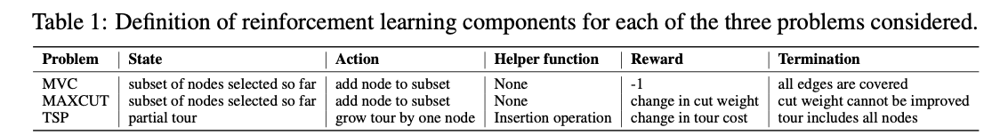 

***Learning algorithm***

> It is known that *off-policy* reinforcement learning algorithms such as Q-learning can be more sample efficient than their policy gradient counterparts.

Standard (1-step) Q-learning: 
$$
(\gamma {\rm max}_{v'}\hat{Q}(h(S_{t+1}), v'; \Theta)+r(S_t,v_t) - \hat{Q}(h(S_t),v_t;\Theta))^2
$$
n-step Q-learning (delayed-reward):
$$
(\sum_{i=0}^{n-1}r(S_{t+i},v_{t+i}) + \gamma{\rm max}_{v'}\hat{Q}(h(S_{t+n}), v';\Theta) - \hat{Q}(h(S_t),v_t;\Theta))^2
$$

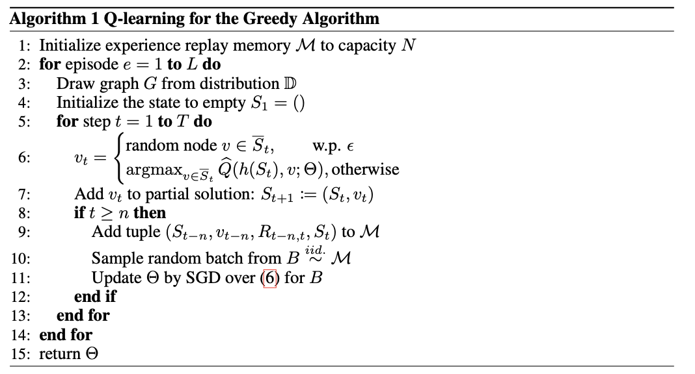 

***Experiments***

* Structure2Vec Deep Q-learning(S2V-DQN)
* Pointer Networks with Actor-Critic(PN-AC)
* Baseline Algorithms: Powerful approximation or heuristic algorithms

The approximation ratio of a solution S to a problem instance G: 
$$
R(S,G)=max(\frac{OPT(G)}{c(h(S))}, \frac{c(h(S))}{OPT(G)})
$$
For TSP, where the graph is essentially fully connected (graph structure is not as important), it is harder to learn a good model based on graph structure. 

#### 9. Exact Combinatorial Optimization with Graph Convolutional Neural Networks (NeurIPS-19)

>We propose a new graph convolutional neural network model for learning branch-and-bound variable selection policies, which leverages the natural variable-constraint bipartite graph representation of mixed-integer linear programs. We train our model via imitation learning from the strong branching expert rule.

***Contributions***

* We propose to encode the branching policies into a graph convolutional neural network (GCNN), which allows us to exploit the natural bipartite graph representation of MILP problems, thereby reducing the amount of manual feature engineering.

* We approximate strong branching decisions by using behavioral cloning with a cross-entropy loss, a less difficult task than predicting strong branching scores [3] or rankings.

  > Khalil et al. [3] and Hansknecht et al. treat it as a **ranking** problem and learn a partial ordering of the candidates produced by the expert, while Alvarez et al. treat it as a **regression** problem and learn directly the strong branching scores of the candidates. In contrast, we treat it as a **classification** problem and simply learn from the expert decisions, which allows imitation from experts that don’t rely on branching scores or orderings. 

***Markov decision process formulation***

State $$s_t$$ comprises the B&B tree with all past branching decisions, the best integer solution found so far, etc. The brancher then selects a variable $$a_t$$ among all fractional variables $$A(s_t)\subseteq\{1,\dots,p\}$$ at the currently focused node, according to a policy $$\pi(a_t|s_t)$$. The solver in turn extends the B&B tree, solves the two child LP relaxations, runs any internal heuristic, prunes the tree if warranted, and finally selects the next leaf node to split. We are then in a new state $$s_{t+1}$$, and the brancher is called again to take the next branching decision. 

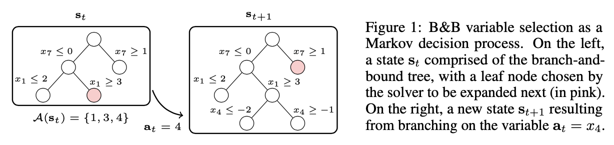 

The probability of a trajectory $$\tau=(s_0,\dots,s_T) \in \Tau$$ then depends on both the branching policy π and the remaining components of the solver.
$$
p_{\pi}(\tau) = p(s_0)\prod_{t=0}^{T-1}\sum_{a\in A(s_t)}\pi(a|s_t)p(s_{t+1}|s_t,a)
$$
***Methodology***

> A natural approach to find good branching policies is reinforcement learning, with a carefully designed reward function. However, this raises several key issues: *(i)* so slow early in training as to make total training time prohibitively long; *(ii)* once the initial state corresponding to an instance is selected, the rest of the process is instance-specific, and so the Markov decision processes tend to be extremely large. **(?)**

Imitation learning by minimizing the cross-entropy loss: 
$$
\mathcal{L}(\theta) = -\frac{1}{N}\sum_{(s,a^*)\in \mathcal{D}}\log\pi_{\theta}(a^*|s)
$$

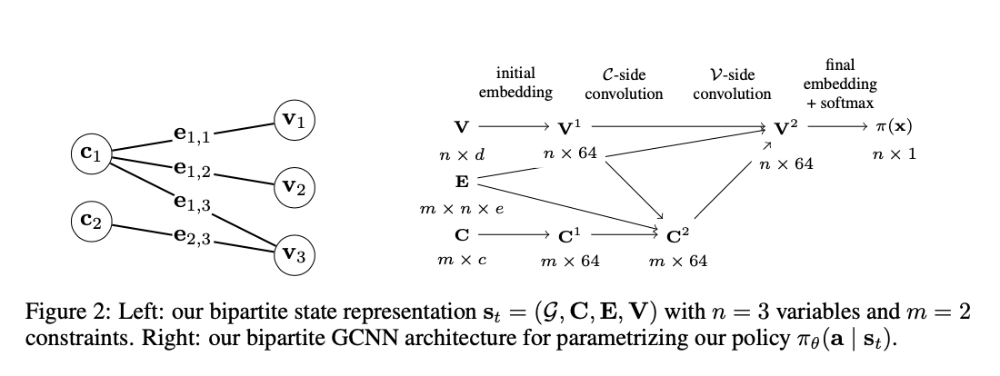 

#### 10. An Efficient Graph Convolutional Network Technique for the Travelling Salesman Problem @NTU

> We use deep Graph Convolutional Networks to build efficient TSP graph representations and output tours in a **non-autoregressive** manner via highly parallelized beam search.

In contrast to autoregressive approaches, Nowak et al. [2017] trained a graph neural network in a supervised manner to directly output a tour as an **adjacency matrix**, which is converted into a feasible solution using **beam search**. Due to its one-shot nature, the model cannot condition its output on the partial tour and performs poorly for very small problem instances. Our non-autoregressive approach builds on top of this work.

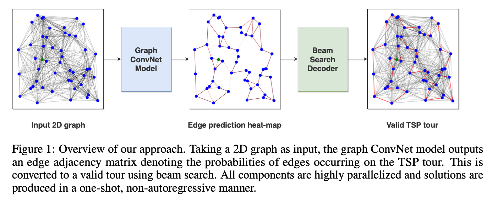 

***Methodology***

Node: $$x_i \in [0,1]^2$$
$$
\alpha_i = A_1x_i+b_1
$$
Edge: edge Euclidean distance $$d_{ij}$$
$$
\beta_{ij} = A_2d_{ij}+b_2||A_3\delta_{ij}^{k-NN}
$$
Graph Convolution layer: $$x_i^{l=0}=\alpha_i$$ and $$e_{ij}^{l=0}=\beta_{ij}$$
$$
x_i^{l+1} = x_i^l + {\rm ReLU}({\rm BN}(W_i^lx_i^l+\sum_{j\sim i}\eta_{ij}^l\odot W_2^lx_j^l))
$$

$$
\eta_{ij}^l=\frac{\sigma(e_{ij}^l)}{\sum_{j'\sim i}\sigma(e_{ij'}^l)+\varepsilon}
$$

$$
e_{ij}^{l+1} = e_{ij}^l + {\rm ReLU}({\rm BN}(W_3^le_{ij}^l+w_4^lx_i^l+W_5^lx_j^l))
$$

As arbitrary graphs have no specific orientations (up, down, left, right), a diffusion process on graphs is consequently ***isotropic***, making all neighbors equally important. We make the diffusion process ***anisotropic*** by point-wise multiplication operations with learneable normalized edge gates $$e_{ij}^l$$ such as in [Marcheggiani and Titov, 2017].

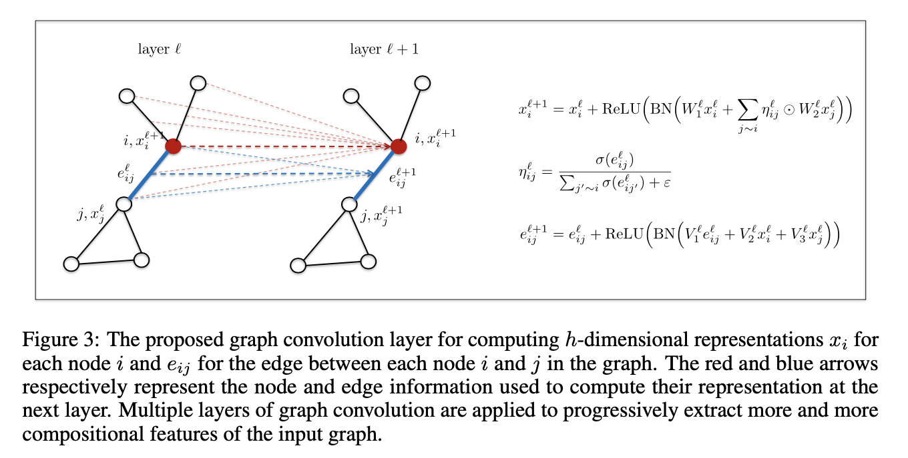 

MLP classifier:
$$
p_{ij}^{TSP}=MLP(e_{ij}^L)
$$

$$
p(\pi')=\prod_{j'\sim i'\in \pi'}p_{i'j'}^{TSP}
$$

Decoding:

* Greedy search
* Beam search
* Beam search and Shortest tour heuristic

### 08/07/2020

#### 11. ATTENTION, LEARN TO SOLVE ROUTING PROBLEMS (ICLR-19)

>We propose a model based on ***attention layers*** with benefits over the Pointer Network and we show how to train this model using REINFORCE with a simple baseline based on a ***deterministic greedy rollout***, which we find is more efficient than using a value function.
>
>Travelling Salesman Problem (TSP); Vehicle Routing Problem (VRP); Orienteering Problem (OP); Prize Collecting TSP (PCTSP); Stochastic PCTSP (SPCTSP).

***Model Structure***
$$
p_\theta(\pi|s) = \prod_{t=1}^n p_\theta(\pi_{t}|s, \pi_{1:t-1})
$$

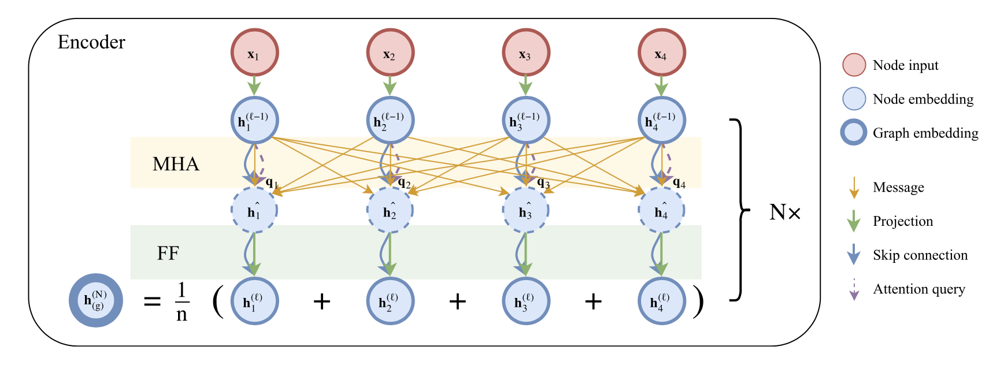 

Node embeddings $$h_i^{(N)}$$ and the Graph embedding $$\bar{h}^{(N)}$$: 

$$
h_i^{(0)} = W^xx_i+b^x
$$

$$
\hat{h}_i=BN^l(h_i^{(l-1)}+MHA_i^l(h_1^{(l-1)},\dots,h_n^{(l-1)}))
$$

$$
h_i^{(l)}=BN^l(\hat{h}_i+FF^l(\hat{h}_i))
$$

$$
\bar{h}^{(N)}=\frac{1}{N}\sum_{i=1}^nh_i^{(N)}
$$

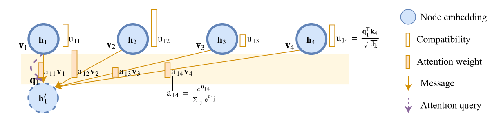 
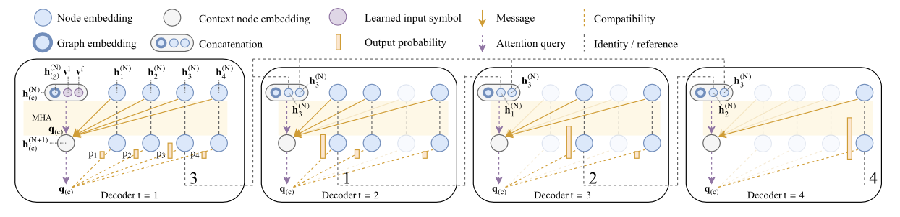 

Context embedding $$h_{(c)}^{(N)}$$:

$$
h_{(c)}^{(N)} = \begin{cases}[\bar{h}^{(N)}, h_{\pi_t-1}^{(N)}, h_{\pi_1}^{(N)}] & t>1 \\ [\bar{h}^{(N)}, v^l, v^f] & t=1\end{cases}
$$

$$
q_{(c)} = W^Qh_{(c)} \quad k_i=W^Kh_i \quad v_i=W^Vh_i
$$

$$
u_{(c)j}=\begin{cases}\frac{q_{(c)}^Tk_j}{\sqrt{d_k}} & if\space j\ne \pi_{t'} \space \forall t' < t \\ -\infty & {\rm otherwise.} \end{cases}
$$

$$
a_{(c)j} = \frac{e^{u_{(c)j}}}{\sum_{j'}e^{u_{(c)j'}}}
$$

$$
h_{(c)}'=\sum_j a_{(c)j}v_j
$$

$$
h_{(c)}^{(N+1)} = MHA_{(c)}(h_1,\dots,h_n) = \sum_{m=1}^M W^O_mh_{(c)m}'
$$

Calculation of log-probabilities:
$$
 u_{(c)j}=\begin{cases}C\cdot{\rm tanh}\left(\frac{q_{(c)}^Tk_j}{\sqrt{d_k}}\right) & if\space j\ne \pi_{t'} \space \forall t' < t \\ -\infty & {\rm otherwise.} \end{cases}
$$

$$
p_i=p_\theta(\pi_t=i|s,\pi_{1:t-1})=\frac{e^{u_{(c)i}}}{\sum_{j}e^{u_{(c)j}}}
$$

***REINFORCE With Greedy Rollout Baseline***
$$
\nabla \mathcal{L}(\theta|s) = \mathbb{E}_{p_{\theta}(\pi|s)}[(L(\pi)-b(s)) \nabla\log p_\theta(\pi|s)]
$$

baseline example:

$$
b(s) = M \gets \beta M+(1-\beta)L(\pi) \qquad L(\theta_v) = \frac{1}{B}\sum_{i=1}^B||b_{\theta_v}(s_i) - L(\pi_i|s_i)||_2^2
$$

We propose to use a rollout baseline in a way that is similar to self-critical training: $$b(s)$$ is the cost of a solution from a *deterministic greedy rollout* of the policy defined by the best model so far.

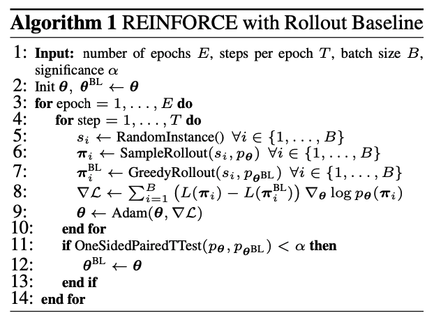 

***Experiments***

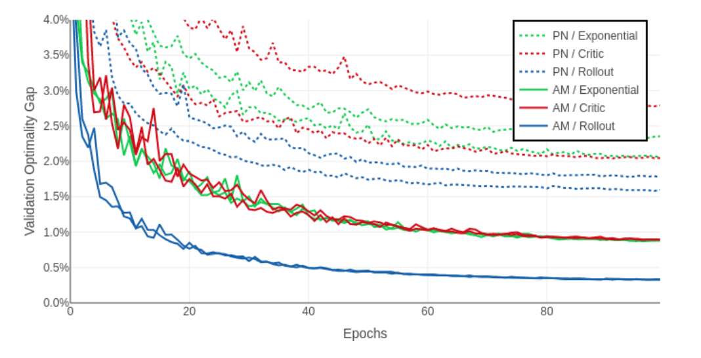 

#### 12. Learning to Search in Branch-and-Bound Algorithms (NeurIPS-14)

>We address the key challenge of learning an ***adaptive node searching order*** for any class of problem solvable by branch-and-bound. Our strategies are learned by ***imitation learning***.

***Branch-and-Bound Framework***

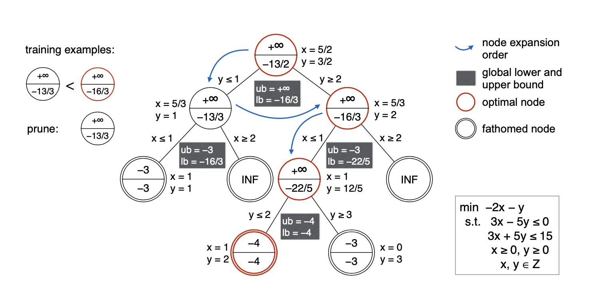 
Using branch-and-bound to solve an integer linear programming minimization.

***Learning Control Policies for Branch-and-Bound***

The <u>node selection policy</u> $$\pi_S$$ determines the priorities used. Once the highest-priority node is popped, the <u>node pruning policy</u> $$\pi_P$$ decides whether to discard or expand it given the current progress of the solver. This process continues iteratively until the tree is empty or the gap reaches some specified tolerance.

**Oracle**: The node selection oracle $$\pi_S^*$$ will always expand the node whose feasible set contains the optimal solution. We call such a node an <u>optimal node</u>. For example, in Figure 1, the oracle knows beforehand that the optimal solution is x = 1, y = 2, thus it will only search along edges $$y\ge2$$ and $$ x\le1$$; the optimal nodes are shown in red circles. All other non-optimal nodes are fathomed by the node pruning oracle $$\pi_P^*$$, if not already fathomed by standard rules. 

**Imitation Learning (DAgger)**: 

State: the whole tree of nodes visited so far, with the bounds computed at these nodes.

Action: 

* node selection policy $$\pi_S$$: select node $$\mathcal{F}_i: \mathcal{F}_i \in queue \space of \space active \space nodes$$

* node pruning policy $$\pi_P$$: a binary classifier that predicts a class in $$\{prune, expand\}$$

Score: A generic node selection policy assigns a score to each active node and pops the highest-scoring one.
$$
\pi_S(s_t) = argmax_{\mathcal{F_i \in L}} w^T\phi(\mathcal{F}_i)
$$

> SCIP’s default node selection strategy switches between DFS and best-first search according a plunging depth computed online. DFS uses a node’s depth as its score; best-bound-first search uses a node’s lower bound as its score.

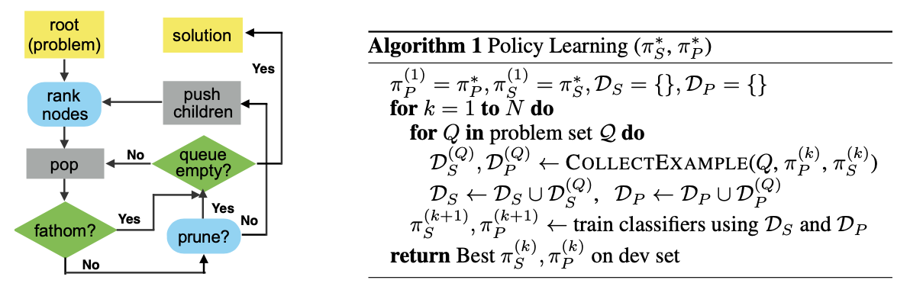 
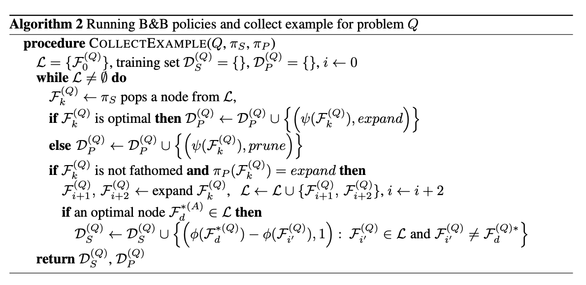

#### 13. Learning to Run Heuristics in Tree Search (IJCAI-17)

> In this work, we study the problem of deciding at which node a heuristic should be run, such that the overall (primal) performance of the solver is optimized. 

***Introduction***

To use the terminology of MIP, <u>the primal side</u>(focused) refers to the quest for good feasible solutions, whereas the dual side refers to the search for a proof of optimality.

**Primal heuristics** are incomplete, bounded-time procedures that attempt to find a good feasible solution. Primal heuristics may be used as standalone methods, taking in a MIP instance as input, and attempting to find good feasible solutions, or as sub-routines inside branch-and-bound, where they are called periodically during the search. In this work, we focus on the latter.

Our Problem Setting: ***When and what heuristics*** should be run during the search?

***Primal Integral - primal performance criterion***

Let $x^*$ denote an optimal (or best known) solution; $\tilde{x}$ denote a feasible solution; The *primal gap* $\gamma \in [0,1]$ of solution $\tilde{x}$ is defined as:
$$
\gamma(\tilde{x}) = \begin{cases} 0, & if\space |c^Tx^*|=|c^T\tilde{x}|=0 \\
1, & if \space c^Tx^*\cdot c^T\tilde{x}<0 \\
\frac{|c^Tx^*-c^T\tilde{x}|}{\max\{|c^Tx^*|,|c^T\tilde{x}|\}}, & {\rm otherwise.}
\end{cases}
$$

$$
p(t):=\begin{cases}1,& {\rm if \space no \space incumbent\space is\space found\space until\space point}\space t, \\
\gamma(\tilde{x}(t)), & {\rm with}\space\tilde{x}(t)\space {\rm the\space incumbent\space at\space point}\space t.
\end{cases}
$$

The *primal integral* $P(T)$ of a branch-and-bound run until a point in time $T \in [0,t_{max}]$ is defined as:
$$
P(T):=\sum_{i=1}^{Inc+1}p(t_{i-1})\cdot(t_i-t_{i-1})
$$

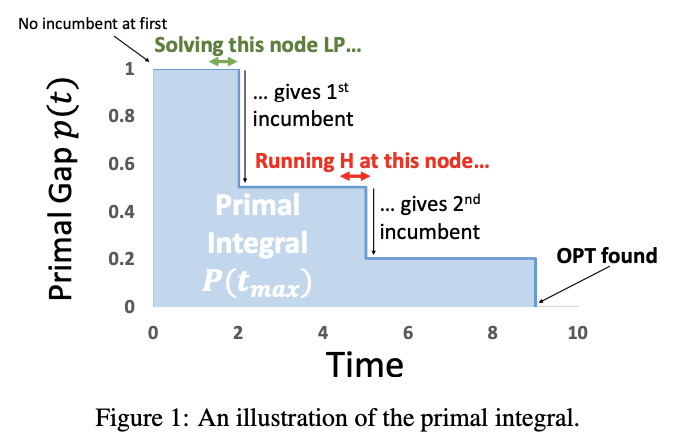 

The ***smaller*** $P(t_{max})$ is, the better the incumbent finding. As such, we will consider optimizing the *primal integral* directly, by means of making good decisions regarding whether a primal heuristic should be run at each node or not.

***Problem Formulation***

Primal Integral Optimization (PIO): Given a primal heuristic $H$, a branch-and-bound MIP solver with search tree $\mathcal{T}$ and a time cut-off $t_{max}$, find the subset of nodes of $\mathcal{T}$ at which executing $H$ results in a primal integral $P(t_{max})$of minimum value.

Two main settings:

* the *offline* setting, where the search tree T is *fixed and known* in advance, and PIO amounts to finding the best subset of nodes to run H at in hindsight;

* the *online* setting, where one must sequentially decide, at each node, whether H should be run, without any knowledge of the remainder of the tree or search.

***Logistic Regression***

Oracle Learning: 

* The model $W_H$ is simply a weight vector for the node features, such that the dot product $<w_H , x^N>$ between $w_H$ and node N ’s feature vector $x^N$ gives an estimate of the probability that heuristic H finds an incumbent at N. 

MIP Solving:

* We use the learned oracles in conjunction with the Run-When-Successful (RWS) rule to guide the decisions as to whether each of the ten heuristics should be run at each node.

